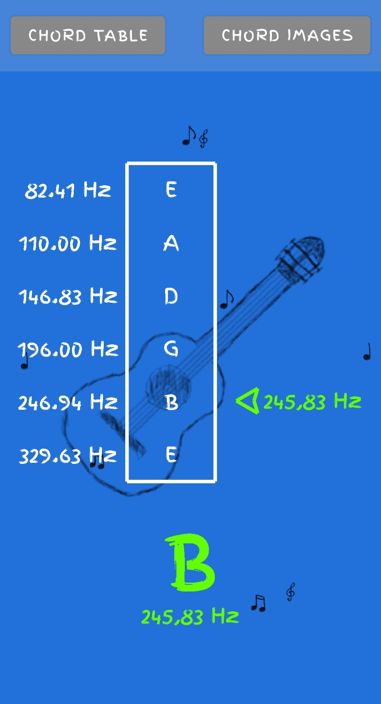
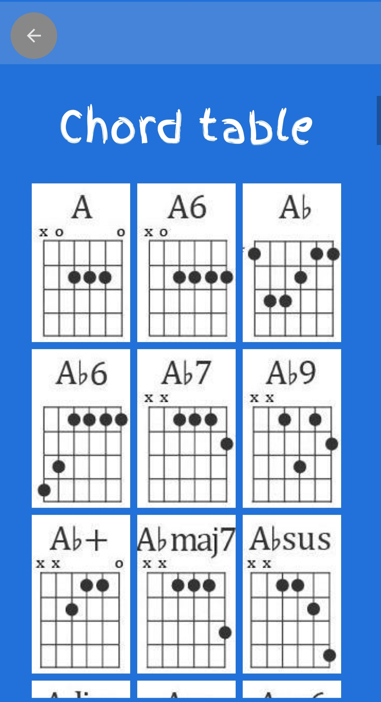
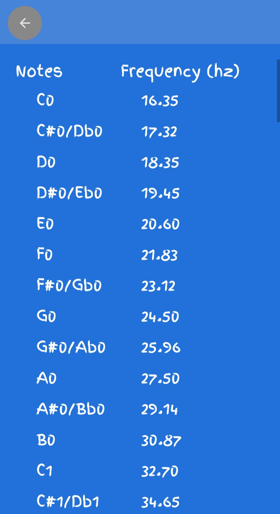

# GuitarTunerX2000

This is an android app that is used to help you tune your guitar. The phone uses the microphone to record audio and then shows the predicted fundamental frequency of this audio. Together with som UI, this hopefully makes it easy to visualize how close you are to the correct frequency for a specific pitch.

 This is done with the help of [TarsosDSP](https://github.com/JorenSix/TarsosDSP) lirary that does the digital processing. More specifically, the audio data that is sampled by the Android API, then fed to a pitchdetctor, which predicts the frequency. The pitchdetector uses the FastYin algorithm, which is based on the [Yin paper](http://audition.ens.fr/adc/pdf/2002_JASA_YIN.pdf).

